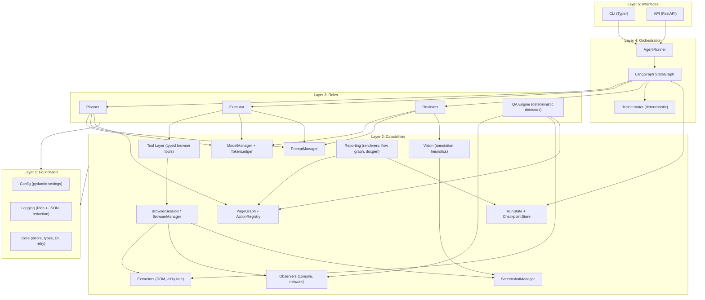

# Component Diagram and Responsibilities

Logical components, their dependency edges, and the rules that keep the graph acyclic. Physical placement: `folder-structure.md`. Decision references (Dn): `overview.md`.

## Component diagram

Edges into Layer 1 are collapsed: every component uses Config, Logging, and Core.

## Responsibilities and contracts

| Component | Single responsibility | Key contract (typed) |
|---|---|---|
| CLI | Parse args, render Rich progress, exit codes | calls `AgentRunner.run / resume / report` |
| API | HTTP surface, run registry, progress streaming | same `AgentRunner` calls, plus job store |
| AgentRunner | Run lifecycle: create, resume, interrupt, budgets, artifact dir | `run(config) -> RunResult` |
| StateGraph | Node wiring, checkpointing, replay | `AgentState` in, `AgentState` out per node |
| decide router | Verdict + budgets + loop detector to next edge | `(AgentState) -> Edge` pure function (D11) |
| Planner | Snapshot + memory to prioritized task queue | `plan(PlannerInput) -> Plan` |
| Executor | One `PlanStep` to `ExecutionResult` via tools only | `execute(step, session) -> ExecutionResult` |
| Reviewer | Expected vs observed to verdict with reasons | `review(step, result) -> ReviewVerdict` |
| QA Engine | Observations to findings with severity | `detect(ObservationBundle) -> list[QaFinding]` |
| Tool Layer | Whitelisted, schema-validated browser operations | `ToolCall -> ToolResult`, rejects unknown element IDs (D6) |
| BrowserSession | Playwright facade: context, page, capture, storage | async context manager |
| Extractors | Page to `PageSnapshot` (inventory, metadata) | `extract(page) -> PageSnapshot` |
| Observers | Console/network event capture per step window | `drain() -> ObservationBundle` |
| ScreenshotManager | Capture, dedupe, file naming, artifact paths | `capture(tag) -> ArtifactRef` |
| Vision | Annotate screenshots, heuristic visual checks | optional; multimodal off by default |
| ModelManager | Provider calls, retries, rate limit, record/replay | `complete(role, prompt, schema) -> ParsedT` |
| TokenLedger | Usage and cost accumulation per role and run | `record(usage)`, totals in state |
| PromptManager | Versioned templates, strict rendering | `render(name, vars) -> Prompt` |
| PageGraph | Visited pages, navigation edges, frontier | feeds planner and flow-graph reports |
| ActionRegistry | Normalized action signatures, dedupe | `seen(signature) -> bool` |
| RunState / CheckpointStore | Durable state, serialization, resume | LangGraph checkpointer adapter (D8) |
| Reporting | QA report, docs, flow graph, exports | `render(RunResult) -> artifacts` |
| Config | Layered settings, validation | frozen settings object via DI |
| Logging | Structured events, correlation IDs, redaction | `get_logger(component)` |
| Core | Errors, shared types, DI container, retry policies | imported by everyone |

## Dependency rules (enforced in review and lint)

1. Downward-only imports across layers (L5 to L1). No exceptions.
2. Roles never import Playwright or the `openai` SDK directly: Planner/Executor/Reviewer see only `tools/`, `llm/`, `prompts/`, `memory/` interfaces.
3. The executor is the only role allowed to invoke the tool layer.
4. `decide` imports no I/O modules at all: pure function over `AgentState` (D11).
5. Interfaces (CLI, API) contain zero business logic: anything both need lives in `AgentRunner`.
6. Everything below Layer 3 is LLM-free and must be testable without a model or network.

## Seams for testing

Protocols (structural interfaces) exist for: model client, browser session, clock, ID generator, artifact store, checkpoint store. Unit tests substitute fakes at these seams; integration tests use real Playwright against local fixture sites; no test reaches the public internet (D9, D13).
