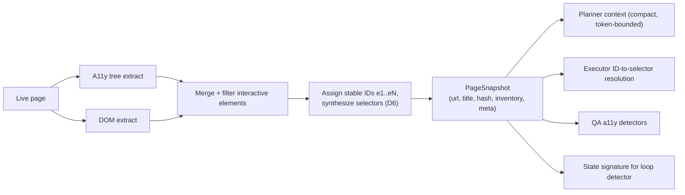
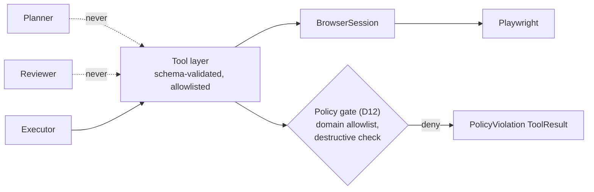
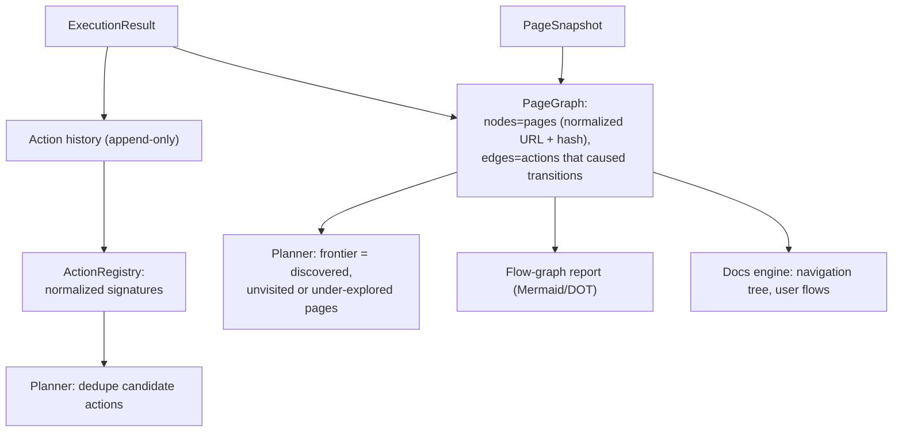
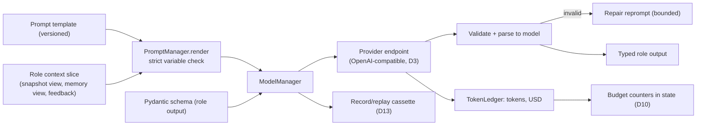

# Data Flow, Tool Flow, Memory Flow

What data exists, who produces it, who consumes it, and where it rests. Companion to `state-machine.md` (when) and `components.md` (who).

## 1. Core data artifacts

| Artifact | Producer | Consumers | At rest |
|---|---|---|---|
| `PageSnapshot` | Extractors | Planner, Executor, Reviewer, QA, loop detector | latest in state; full copies in `reports/<run_id>/snapshots/` |
| `ElementInventory` (in snapshot) | Extractors (a11y + DOM) | Planner (action inference), Executor (ID resolution) | inside snapshot |
| `Plan` / `PlanStep` | Planner | Executor, decide, reports | state |
| `ToolResult` | Tool layer | Executor | folded into ExecutionResult |
| `ObservationBundle` | Observers + ScreenshotManager | Reviewer, QA engine | refs in state; bodies on disk |
| `ExecutionResult` | Executor | Reviewer, action history | state (append-only history) |
| `ReviewVerdict` | Reviewer | decide, QA candidates | state |
| `QaFinding` | QA engine | Reporting | `reports/<run_id>/qa/` |
| `PageGraph` | Memory | Planner (frontier), flow-graph report, docs engine | serialized with checkpoints |
| `ActionSignature` | Memory (from ActionRecords) | Planner dedupe | serialized with checkpoints |
| `TokenLedger` entries | ModelManager | budgets, eval harness, reports | state counters + JSONL log |
| Reports (MD/JSON/CSV/HTML) | Reporting | humans, CI, eval harness | `reports/<run_id>/` |

Rule (D8): state holds small structured data and `ArtifactRef` paths; binaries and large text always go to the run's artifact directory.

## 2. Snapshot pipeline (page to prompt)

The snapshot is the single source of truth about "what the page is right now". Every role reads the same snapshot; nobody re-queries the DOM ad hoc. The prompt-facing rendering is token-bounded: inventory truncates by salience (viewport visibility, role weight, novelty) with an explicit `truncated: true` marker so the planner knows the view is partial.

## 3. Tool flow (who may touch the browser)

- Tool set (Phase 3/7): `navigate`, `click`, `fill`, `select`, `press_key`, `scroll`, `wait_for`, `go_back`, `extract_snapshot`, `screenshot`, `handle_dialog`, `switch_tab`, `download`.
- Every call validates against a Pydantic schema; element-addressing calls must reference an ID present in the current inventory, otherwise the call is rejected before touching the browser (hallucination firewall, D6).
- The policy gate runs before every navigation and destructive-class action.
- Observers run continuously; the tool layer stamps step boundaries so each `ObservationBundle` contains exactly the console/network events attributable to that step window.

## 4. Memory flow

Two memory structures, both run-scoped and checkpointed:

- **ActionSignature** = hash(normalized URL, element signature, action type, normalized input class). Element signature uses role+name+testid, not the ephemeral eN ID, so dedupe survives re-snapshots. Details: `planner.md`.
- **PageGraph** nodes key on normalized URL plus content-class hash, so `/product/1` and `/product/2` can collapse into one template node when structurally identical (coverage without combinatorial explosion).
- Memory is intentionally not a vector store: exploration needs exact dedupe and graph traversal, not similarity search. If semantic recall becomes necessary (Phase 6+ evidence), it will be added behind the memory interface without touching the roles. Logged as a deferred decision.

## 5. LLM data flow

Each role sees a curated context slice, never the whole state: planner gets snapshot + frontier + failures; reviewer gets one step's expectation + observations; executor gets one step + inventory. Slicing is the token-cost control point and is owned by each role's context builder, not by the prompt template.

## 6. Persistence map

| Store | Contents | Written | Read |
|---|---|---|---|
| SQLite checkpoint DB | AgentState per node transition (LangGraph SqliteSaver) | every node | resume, replay, debugging |
| `reports/<run_id>/snapshots/` | PageSnapshot JSON per step | executor | QA, docs engine, debugging |
| `reports/<run_id>/screenshots/` | PNG per step and per finding | ScreenshotManager | reports, vision |
| `reports/<run_id>/network/` | Request/response log JSONL (bodies truncated, secrets redacted) | observers | QA detectors, debugging |
| `reports/<run_id>/console/` | Console events JSONL | observers | QA detectors |
| `reports/<run_id>/llm/` | Prompt/response records (redacted), token JSONL | ModelManager | eval harness, replay |
| `reports/<run_id>/output/` | QA report, docs, flow graph, exports | Reporting | end users, API downloads |
| SQLite runs index | run_id, config, status, totals | AgentRunner | CLI/API listing, eval |

Redaction (D12) applies at write time for network, console, and LLM records: values matching secret patterns and any credential form inputs are masked before touching disk.
