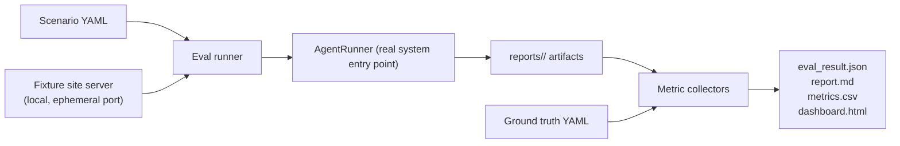

# Evaluation Architecture

How we know the agent is good, and catch it getting worse. Everything measurable, everything reproducible, zero required API spend (D9, D13).

## 1. Principles

- **Ground truth or it does not count.** Precision/recall style metrics run only against fixture sites with labeled defects. Live-site runs produce operational metrics (cost, latency, retries) but no quality claims.
- **Deterministic by default.** Harness runs use replay cassettes and local fixture sites; a full eval works offline. Live-model eval is an explicit opt-in flag with cost printed up front.
- **Role-level and system-level.** The system score can mask a bad planner rescued by retries; per-role metrics localize regressions.

## 2. Fixture corpus

`tests/fixtures/sites/` plus `evaluation/ground_truth/`, grown across phases:

| Fixture site | Contents | Exercises |
|---|---|---|
| `static-basic` | multi-page static site, nav, footer links | crawl, PageGraph, coverage |
| `forms-app` | small FastAPI app: forms, validation, auth flow | fills, submits, auth, storage state |
| `defects-site` | seeded defects: broken links, 404/500 endpoints, console errors, dead buttons, missing labels, redirect traps, slow endpoints | QA precision/recall |
| `spa-app` | client-routed SPA, modals, dynamic lists, pagination | snapshot extraction, loop resistance |
| `maze-site` | deep link chains, circular nav, infinite pagination | loop detection, depth penalty, budgets |

Ground truth format (YAML per site):

```yaml
site: defects-site
defects:
  - id: GT-001
    kind: broken_link
    location: "/pricing"
    selector_hint: "footer a[href='/enterprise']"
    severity: major
    notes: "target returns 404"
pages:
  expected_reachable: 14
elements:
  expected_interactive: 87
```

`kind` values align 1:1 with QA-engine detector IDs (Phase 10) so matching findings to truth is mechanical.

## 3. Metrics

### System metrics

| Metric | Definition |
|---|---|
| Task completion | goal-defined success predicate met (per scenario) |
| Page coverage | reachable pages visited / expected_reachable |
| Element coverage | interactive elements exercised / expected_interactive |
| Navigation success rate | successful navigations / attempted |
| Retry rate | retried steps / total steps (split by failure class F1..F6) |
| Loop frequency | loop-detector triggers per 100 steps |
| Bug precision | true findings / all findings (matched to ground truth by kind + location) |
| Bug recall | found defects / seeded defects |
| Severity accuracy | findings whose severity matches truth / matched findings |

### Cost and performance metrics

| Metric | Definition |
|---|---|
| Latency | wall-clock per run; p50/p95 per step and per node |
| LLM calls | total, split by role |
| Tokens | prompt + completion, split by role |
| Cost (USD) | ledger total at the run's price table (0 for local/replay) |
| Screenshots | count and bytes |
| Steps | executed steps; steps-per-page-discovered (efficiency) |

### Role metrics

| Role | Metric |
|---|---|
| Planner | coverage-per-step, duplicate-proposal rate, off-inventory reference rate (must be 0) |
| Executor | tool-failure rate by class, ghost-action rate (claimed success, reviewer refuted) |
| Reviewer | verdict accuracy vs labeled step outcomes on scripted scenarios; hallucination-catch rate |
| QA engine | per-detector precision/recall |

## 4. Scenario format

`evaluation/scenarios/*.yaml`:

```yaml
name: explore-defects-site
site: defects-site
goal:
  mode: explore
  start_url: "{site_base}/"
budgets: {max_steps: 60, max_usd: 0.50, max_wall_seconds: 900}
model_profile: replay          # replay | local | live
success:
  min_page_coverage: 0.9
  min_bug_recall: 0.7
  min_bug_precision: 0.8
repeat: 3                      # live/local modes; replay is deterministic, repeat=1
```

`repeat` with aggregation (mean, min, max) because nondeterministic modes need variance visibility; thresholds gate on min, not mean.

## 5. Harness design

`evaluation/harness/`, run via `website-agent evaluate` (Phase 13):



- The harness invokes the same `AgentRunner` as CLI/API: no eval-only code path, so measurements reflect shipping behavior.
- Collectors are pure functions over artifacts + ground truth: independently unit-tested, reusable over any past run directory (`website-agent evaluate --from-run <id>` re-scores without re-running).
- Finding-to-truth matching: by detector kind + normalized location, with a per-kind tolerance rule (e.g., broken_link matches on target URL). Unmatched findings = false positives; unmatched truths = false negatives; the report lists both explicitly for triage.

## 6. Outputs

| Output | Purpose |
|---|---|
| `eval_result.json` | machine-readable, schema-versioned; CI consumes it for threshold gates |
| `report.md` | human summary: per-scenario table, deltas vs previous baseline if present |
| `metrics.csv` | one row per scenario x repeat, for spreadsheets and history plots |
| `dashboard.html` | single self-contained static file: metric tiles, per-scenario tables, trend section when history dir supplied |

Baselines: `evaluation/baselines/<scenario>.json` committed to the repo; CI compares current run to baseline with tolerance bands and fails on regression beyond tolerance. Updating a baseline is an explicit, reviewed diff.

## 7. CI integration (Phase 16)

- PR pipeline: unit + integration tests, then **eval smoke**: 2 scenarios in replay mode (minutes, zero cost, deterministic).
- Nightly (optional, maintainer-enabled): local-model eval via Ollama on the full scenario set; publishes dashboard artifact.
- Live-model eval: manual workflow dispatch only, requires secret, prints estimated cost before running.

## 8. Anti-goals

- No LLM-as-judge in the core metric path: matching to labeled truth is mechanical. LLM-judge may later assist triage of unmatched findings, never gating scores.
- No public-internet eval targets in CI: nondeterminism and courtesy (D12).
