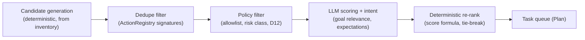

# Planner Architecture

The planner converts "what the agent can see and remembers" into "what the agent should do next, in what order". It is the only component that decides intent; the executor decides mechanics, the reviewer decides truth.

## 1. Contract

```
plan(PlannerInput) -> Plan

PlannerInput:
  goal            GoalSpec           explore | test | document, plus user constraints
  snapshot        PageSnapshotView   token-bounded inventory rendering (data-flow.md s2)
  frontier        FrontierView       unvisited/under-explored pages from PageGraph
  history_digest  HistoryDigest      compressed recent actions, failures, loop warnings
  feedback        ReviewFeedback?    present when routed here via REPLAN
  policy          RunPolicy          allowlist, destructive-action mode (D12)

Plan:
  steps           list[PlanStep]     ordered, deduplicated, policy-filtered
  rationale       str                one-paragraph strategy note (logged, reported)

PlanStep:
  step_id         str
  action          ActionType         click | fill | select | navigate | scroll | ...
  element_id      str?               must exist in snapshot inventory (D6)
  input_spec      InputSpec?         synthetic data class for fills (email, name, ...)
  expectation     Expectation        what should be observable if this works
  priority        float              final score (section 3)
  value_estimate  ValueEstimate      component scores, kept for eval and debugging
  risk            RiskClass          safe | mutating | destructive (policy gate input)
```

`Expectation` is mandatory on every step: it is the reviewer's comparison anchor (e.g., "URL changes to /pricing", "modal with role=dialog appears", "form shows validation error"). A plan step without a falsifiable expectation is invalid by schema.

## 2. Pipeline



Split rationale: candidates come from code, not the model. The LLM never proposes an element that is not in the inventory; it scores, sequences, fills in intent and expectations. This kills selector hallucination at the source and makes the expensive step (LLM) operate on a pre-filtered, pre-deduplicated shortlist.

1. **Candidate generation** (deterministic): every interactive inventory element expands to its afforded actions (link -> navigate-click; input -> fill; select -> choose; button -> click; form -> fill-and-submit composite). Frontier pages expand to navigate candidates.
2. **Dedupe** (deterministic): drop candidates whose ActionSignature is already in the registry (section 4), unless goal mode demands re-visit (e.g., test mode re-submits forms with different input classes).
3. **Policy filter** (deterministic): drop off-allowlist navigations; mark risk class; drop destructive candidates unless policy permits (they surface in the report as "not attempted by policy").
4. **LLM scoring**: model receives goal, snapshot view, frontier, digest, and the candidate shortlist; returns per-candidate goal-relevance scores, ordering intent, input specs, and expectations, as schema-validated output.
5. **Deterministic re-rank**: final priority computed in code (section 3) so ordering is reproducible and unit-testable given fixed LLM scores; queue truncated to `plan_horizon` (default 8) steps.

## 3. Prioritization scoring

```
priority = w_r * goal_relevance      (LLM, 0..1)
         + w_n * novelty             (1 if unseen signature/page, decays with template repeats)
         + w_c * coverage_gain       (est. new elements/pages unlocked; links > inputs > scroll)
         - w_d * depth_penalty       (graph distance from start, discourages rabbit holes)
         - w_f * failure_penalty     (prior failures of similar signatures)
```

Weights are config (per goal mode: explore boosts novelty/coverage, test boosts form and edge-case candidates, document boosts breadth-first coverage). Weights are also eval-harness tunables (Phase 12 measures coverage-per-step under different weight sets).

Value estimation is therefore a hybrid: LLM judges relevance (semantic), code judges novelty/coverage/depth (structural). Neither alone is sufficient: pure-LLM ranking loops on attractive-looking dead ends; pure-structural ranking wastes budget on irrelevant breadth.

## 4. Duplicate avoidance

`ActionSignature = hash(normalized_url_pattern, element_signature, action_type, input_class)`

- `normalized_url_pattern`: query params stripped by default; path segments that look like IDs collapse to `{id}` so `/product/1` and `/product/2` share signatures (template collapse, mirrors PageGraph node keying).
- `element_signature`: role + accessible name + testid/id when present. Deliberately not the ephemeral eN ID and not the CSS path, so dedupe survives re-snapshots and minor DOM shifts.
- `input_class` distinguishes form submissions with different synthetic-data classes (valid email vs malformed email), because in test mode those are distinct, valuable actions.

## 5. Dynamic replanning

The planner runs in three trigger modes, distinguished by input:

| Trigger | Input difference | Behavior |
|---|---|---|
| Queue drained (normal) | no feedback | refresh candidates from current snapshot + frontier |
| REPLAN verdict | `feedback` with failure reason | exclude failed signature, penalize similar candidates, reconsider strategy in rationale |
| Forced replan (loop / resume drift) | loop warning or drift flag in digest | poisoned branch demoted; planner must choose a different frontier region, stated in rationale |

New observations arrive implicitly: each planning pass reads the current snapshot and updated frontier, so discoveries (new nav sections, modals, logged-in state) reshape the very next plan without special-casing.

## 6. Interruptions

- User pause/stop and destructive-approval interrupts happen at graph level (state-machine.md); the planner needs no special handling: it simply plans again from post-interrupt state.
- Goal amendment mid-run (API/CLI, Phase 13/14): runner updates `GoalSpec` in state via checkpoint update; next planner pass picks it up. Old queue is discarded on goal change: stale intent must not outlive its goal.

## 7. Testing strategy (Phase 6)

- Candidate generation, dedupe, policy filter, scoring, re-rank: pure functions, exhaustive unit tests with fixture inventories, no LLM.
- LLM scoring: cassette-replayed (D13) contract tests asserting schema validity and stable re-rank behavior for recorded scores.
- Property tests: planner output never references unknown element IDs; never emits off-allowlist navigation; queue length <= horizon; priorities monotonically ordered.
- Eval (Phase 12): coverage-per-step and loop frequency are the planner's outcome metrics.
