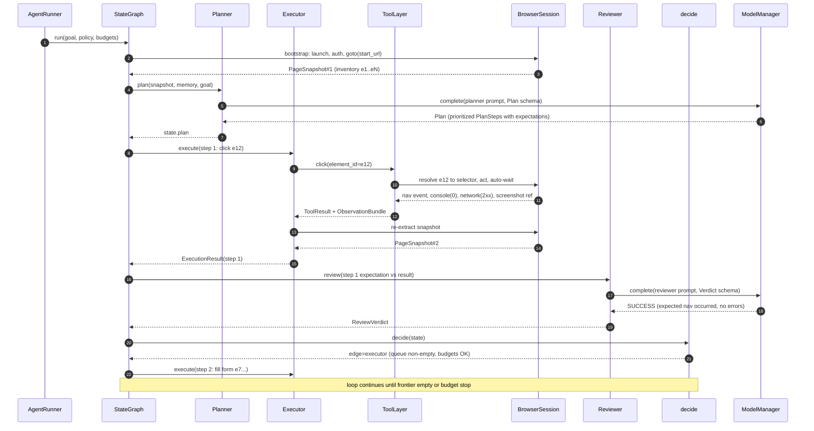
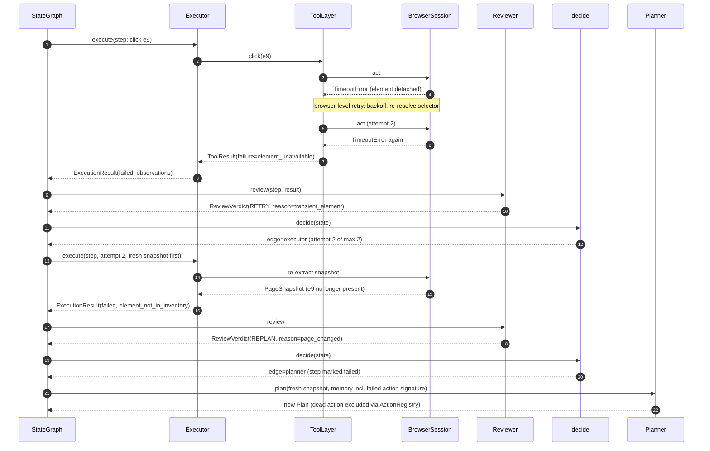

# Sequence Diagrams

Three sequences cover the system's temporal behavior: the happy-path explore loop, in-run failure recovery, and crash resume. Participants map 1:1 to components in `components.md`.

## 1. Explore loop (happy path)

One full cycle: plan, execute two steps, review, continue.



## 2. Failure recovery (element gone stale, retry then replan)

Shows the taxonomy in action: one browser-level retry inside the tool layer, then a step-level RETRY, then escalation to REPLAN. Policies: `failure-recovery.md`.



## 3. Crash resume

Process dies mid-run; user resumes. Checkpoint semantics: `state-machine.md`; rehydration protocol: `failure-recovery.md`.

```mermaid
sequenceDiagram
    autonumber
    participant U as CLI user
    participant R as AgentRunner
    participant C as CheckpointStore
    participant B as BrowserSession
    participant G as StateGraph
    participant P as Planner

    Note over R: process killed after step 14 checkpoint
    U->>R: website-agent run --resume run_abc123
    R->>C: load latest checkpoint(thread_id=run_abc123)
    C-->>R: AgentState (step 14, plan queue, memory refs)
    R->>B: new session, restore storage_state.json
    B-->>R: session ready (cookies, localStorage applied)
    R->>B: goto(state.current_snapshot.url)
    B-->>R: fresh PageSnapshot
    R->>R: compare snapshot hash vs checkpointed hash
    alt hash matches
        R->>G: resume at pending node
    else page drifted
        R->>G: resume with forced-replan flag
        G->>P: plan(fresh snapshot, full memory)
    end
    Note over G: run continues; budgets include pre-crash spend
```

Budget counters (tokens, USD, steps, wall-clock) persist in the checkpoint, so a resumed run cannot exceed its original budget by crashing (D10).
