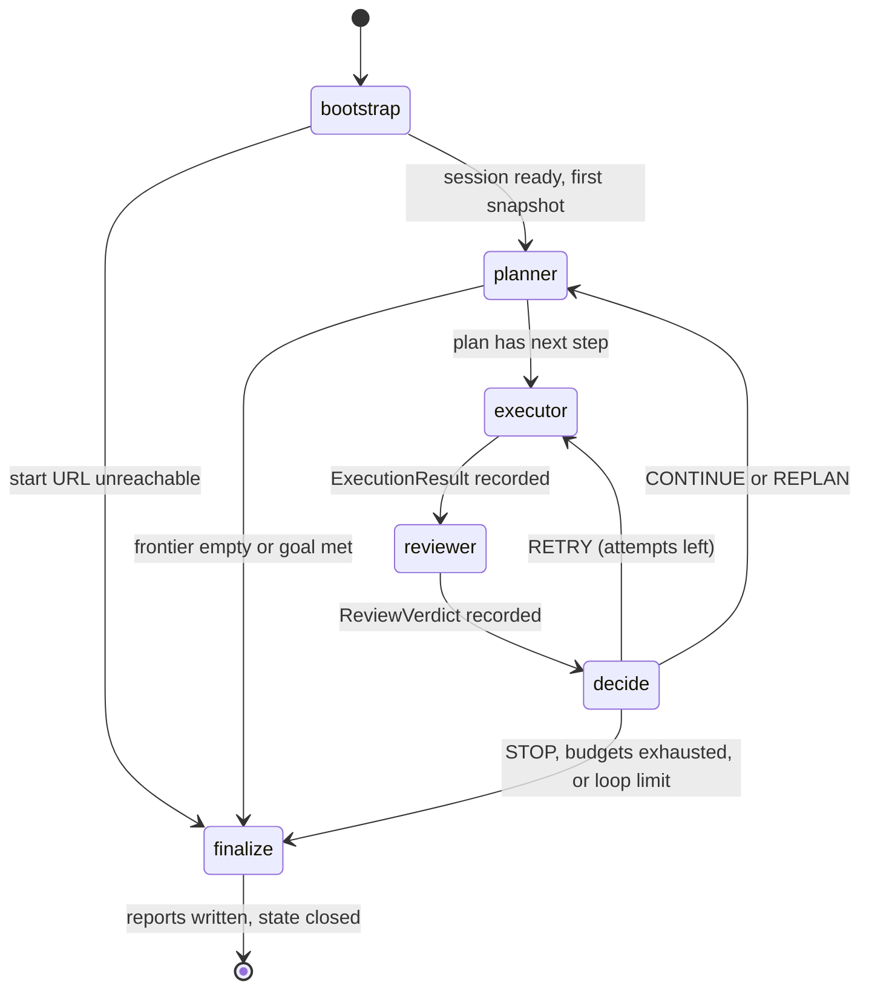

# State Machine

The LangGraph `StateGraph` that drives every run. Nodes, the shared state schema, edge conditions, interrupts, and checkpointing semantics.

## State diagram

## Nodes

| Node | Type | Does | Writes to state |
|---|---|---|---|
| `bootstrap` | deterministic | Start browser session, apply auth/storage state, navigate to start URL, first `PageSnapshot`, init budgets and memory | `current_snapshot`, `page_graph`, `budgets`, `run_meta` |
| `planner` | LLM | Build/refresh prioritized task queue from snapshot, memory, goal, review feedback (see `planner.md`) | `plan`, `frontier` updates |
| `executor` | LLM-assisted, tool-bound | Pop next `PlanStep`, resolve element ID, invoke tool, collect observations and screenshot | `last_result`, `action_history`, `current_snapshot`, artifacts |
| `reviewer` | LLM | Compare step expectation vs `ExecutionResult` observations; classify outcome; flag bugs, hallucinations, loops | `last_verdict`, `qa_candidates` |
| `decide` | deterministic (D11) | Map verdict + counters + budgets + loop detector to exactly one edge | `counters`, `stop_reason` when stopping |
| `finalize` | deterministic | Run QA detector pipeline over accumulated observations, render reports, flow graph, docs; close session; mark run complete | `run_result`, report artifacts |

`bootstrap` and `finalize` extend the spec's four-stage loop: a run needs a defined entry (session acquisition can fail before any planning) and a defined exit (reports must be generated exactly once, including on budget exhaustion).

## State schema (AgentState)

Single Pydantic model, serialized by the checkpointer on every node transition.

| Field | Type | Purpose |
|---|---|---|
| `run_id` | str | Correlation ID for logs, artifacts, checkpoints |
| `goal` | GoalSpec | Mode (explore / test / document), start URL, constraints |
| `policy` | RunPolicy | Domain allowlist, destructive-action policy, auth mode (D12) |
| `budgets` | Budgets | max_steps, max_tokens, max_usd, max_wall_seconds, max_consecutive_failures (D10) |
| `counters` | Counters | steps, retries per step, consecutive failures, tokens, usd, started_at |
| `current_snapshot` | PageSnapshot | Element inventory, URL, title, snapshot hash (D6) |
| `plan` | Plan | Ordered `PlanStep` queue with priorities and expectations |
| `last_result` | ExecutionResult or None | Tool outcome, observations, artifact refs |
| `last_verdict` | ReviewVerdict or None | SUCCESS / RETRY / REPLAN / STOP plus reasons |
| `action_history` | list[ActionRecord] | Append-only executed-action log |
| `page_graph` | PageGraphRef | Visited pages and navigation edges (in memory module, keyed by run) |
| `signatures` | LoopDetectorState | Recent state-signature ring buffer and repeat counts |
| `qa_candidates` | list[QaCandidate] | Reviewer-flagged issues awaiting QA-engine confirmation |
| `stop_reason` | StopReason or None | goal_met, frontier_exhausted, budget_*, loop_limit, fatal_error, user_stop |

Large artifacts (screenshots, raw DOM, network logs) never live in state: state carries `ArtifactRef` paths into `reports/<run_id>/` (D8). Keeps checkpoints small and serialization fast.

## Edge conditions (decide router)

Evaluated in strict priority order; first match wins. Pure function, exhaustively unit-tested.

| Priority | Condition | Edge |
|---|---|---|
| 1 | user interrupt flag set | finalize (stop_reason=user_stop) |
| 2 | any budget exhausted | finalize (stop_reason=budget_*) |
| 3 | verdict STOP | finalize (stop_reason from verdict) |
| 4 | loop detector: signature repeated >= loop_limit | planner with forced-replan flag, once; then finalize (loop_limit) |
| 5 | verdict RETRY and step attempts < max_attempts | executor (same step, attempt+1) |
| 6 | verdict RETRY and attempts exhausted | planner (step marked failed, REPLAN semantics) |
| 7 | verdict REPLAN | planner (with reviewer feedback) |
| 8 | verdict SUCCESS and plan queue non-empty | executor (next step) |
| 9 | verdict SUCCESS and plan queue empty | planner (refresh from frontier) |

Note on 8: successful steps skip the planner (no LLM call) and go straight to the next queued step; the planner only runs when the queue drains or the world changed enough to demand replanning. This roughly halves LLM calls per run versus plan-every-step.

## Interrupts and resume

- **Checkpointing**: LangGraph `SqliteSaver`; thread_id = run_id; a checkpoint after every node (D8).
- **Pause**: graph interrupt before `executor` when (a) user requested pause, or (b) next step is classified destructive and policy requires confirmation (D12). State rests at the checkpoint until resumed with an approve/deny `Command`.
- **Resume after crash**: `AgentRunner.resume(run_id)` reloads the last checkpoint, rehydrates the browser (new session, restore storage state, navigate to `current_snapshot.url`, re-extract), verifies the snapshot hash, and forces one replan if the page drifted. Full protocol: `failure-recovery.md`.
- **Timeouts**: per-node soft timeouts enforced by the runner; a timed-out node yields a RETRY-classed failure, not a hung graph.

## Visualization

`website-agent graph` (Phase 13) renders this compiled graph via LangGraph's built-in Mermaid export, so the shipped diagram is generated from code, not maintained by hand. This document remains the semantic reference.
